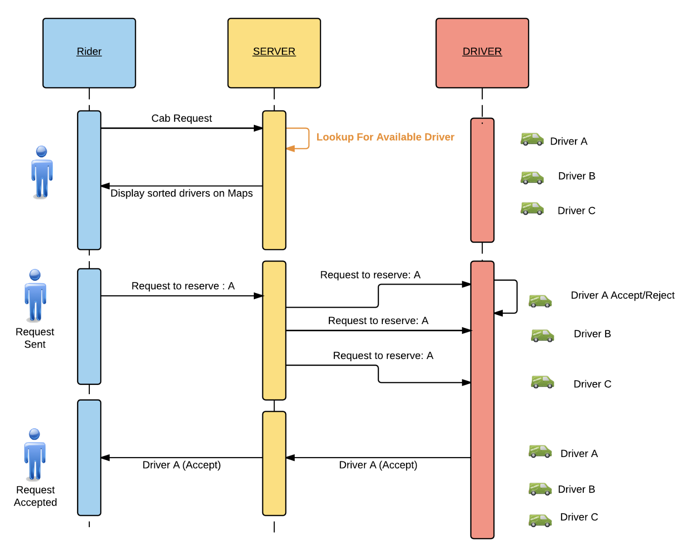

SavMGas

## SavMGas is a rideshare program that help solve the following real life problems
- allow users (drivers and clients to log in using google)
- allow drivers the freedom to select route and time/availabilty at anytime
- give clients a blog channel to express their ride experince to hold SavMGas accountable

# The first phase of this project will focus on developing the blog channel
- log in with google
- add comments
- delete comments
- update comments
- view other users comments

# The second phase will add basic functinality of

- Registering as Driver
- Registering as Rider

# The third phase will

- Find nearest cabs/drivers who have registered themselves in the database
- Lets riders select the most nearest cab
- Lets drivers accept or reject the request from the rider

# Google OAuth is used for authentication and to maintain the rider information in session.

# The Later phase of the project will update

#Driver Registration:
- Driver ID
- latitude
- longitide

#Rider Registration:
- Rider ID
- latitude
- longitide

# Finally, The app will allow drivers to preset their schedule
